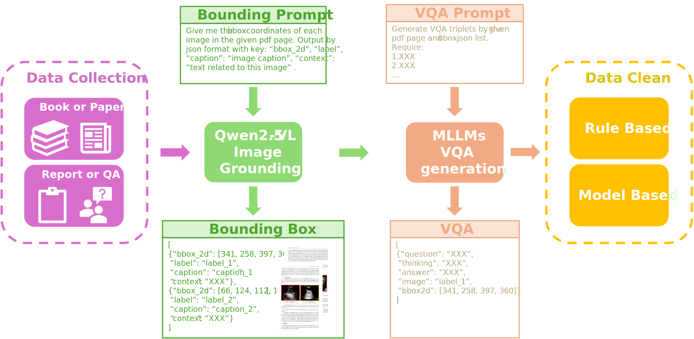
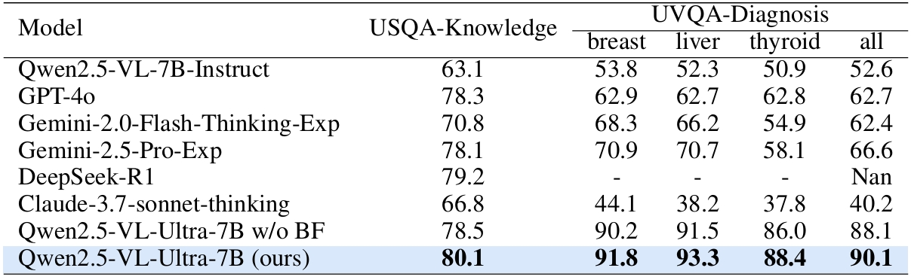

# ReMUD: A Reasoning Multimodal Ultrasound Dataset and Pipeline Brigding to General Specific Domains

This repository is the official implementation of [ReMUD: A Reasoning Multimodal Ultrasound Dataset and Pipeline Brigding to General Specific Domains](./Paper0512.pdf). 

## Requirements

To install requirements:

```setup
pip install -r requirements.txt
```

## Data Process



Replace `YOUR_API_KEY` and `YOUR_API_URL` in `demo.sh` and run:
```
git clone 
bash demo.sh
```
to see a result of the demo.

### 1. Conver PDF to JPG

[pdf2jpg.py](./data/pdf2jpg.py) is a simple Python script that converts PDF files to JPG images. It can process all PDF files in a specified folder and save the converted JPG images to another folder.

This script supports several command-line arguments to customize the conversion process:
```
-f, --folder: The folder path where the PDF documents are saved. The default is ./pdf_files.
-o, --output: The folder path where the converted images are saved. The default is ./image.
--height: The height of the converted images. The default is 1000.
```

### 2. Qwen2.5-VL-7B-Instruct bounding box
You have to prepare a GPU to run `Qwen2.5-VL-7B-Instruct` locally.

[QwenVLbbox.py](./data/QwenVLbbox.py)  will generate the following output:
- Processed Images: The original images with bounding boxes drawn around the detected ultrasound images will be saved in the `save_folder/{page_number} `directory.
- Extracted Images: The individual ultrasound images cropped from the original images will be saved in the `save_folder/{page_number}` directory.
- JSON Files: The bounding box information for each page will be saved in a JSON file named `page_{page_number}.json` in the `save_folder/{page_number}` directory.


The script accepts the following command line arguments:
```
-s, --start_page: The starting page number to process.
-e, --end_page: The ending page number to process.
-d, --device: The device to run the model on (default: cuda:0).
-m, --model: The path to the Qwen2.5-VL model (default: Qwen/Qwen2.5-VL-7B-Instruct).
--image_folder: The folder containing the input images (default: ./image).
--save_folder: The folder to save the processed images and JSON files (default: ./save_bbox).
--system_prompt: The system prompt for the model .
--prompt: The user prompt for the model.
```

### 3. VQA generation

In the [VQA.py](./data/VQA.py) script, you need to set your OpenAI API key and URL. You can also set them through command-line arguments. Replace api_key and api_url with your actual values.

The script accepts the following command line arguments:
```
-s, --start_page: The starting page number. Default is 124.
-e, --end_page: The ending page number. Default is 124.
--api_model: The OpenAI model to use. Default is gpt-4o.
--api_key: Your OpenAI API key.
--api_url: The OpenAI API URL.
--bbox_folder: The folder containing page sub-folders with images and JSON files. Default is ./save_bbox.
--prefix: The prefix for output files and copied images. Default is demo.
--copy_file: Whether to copy image files to a new folder. Set to true or false. Default is true.
--vqa_prompt: The prompt for the VQA task.
--system_prompt: The system prompt for the OpenAI model.
--require_api: Whether to make API requests. Set to true or false. Default is true.
```
## Training

You can use any utils (like [LLaMA-Factory](https://github.com/hiyouga/LLaMA-Factory)) to train your model.

## Evaluation


>📋  Describe how to evaluate the trained models on benchmarks reported in the paper, give commands that produce the results (section below).

## Pre-trained Models

You can download pretrained models here:

- [My awesome model](https://drive.google.com/mymodel.pth) trained on ReMUD.


## Results
Comparison between different MLLMs. Qwen2.5-VL-Ultra-7B achieves better results than other models. DeepSeek-R1 is a single-modal large language model, so it cannot be tested on UVQA-Diagnosis. UVQA-Diagnosis test dataset has three ultrasonic parts: breast, liver and thyroid. "w/o BF" means without using budget forcing.




## Contributing

>📋  Pick a licence and describe how to contribute to your code repository. 
